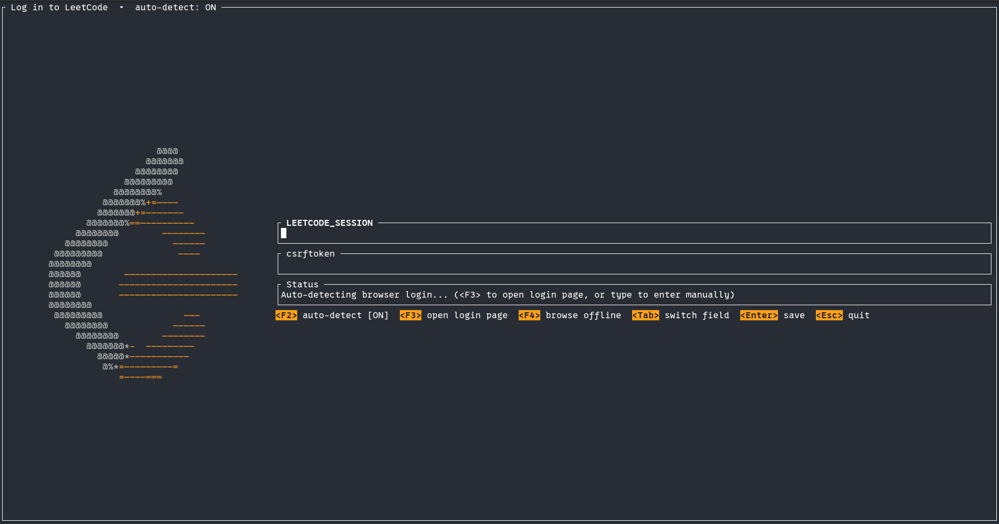
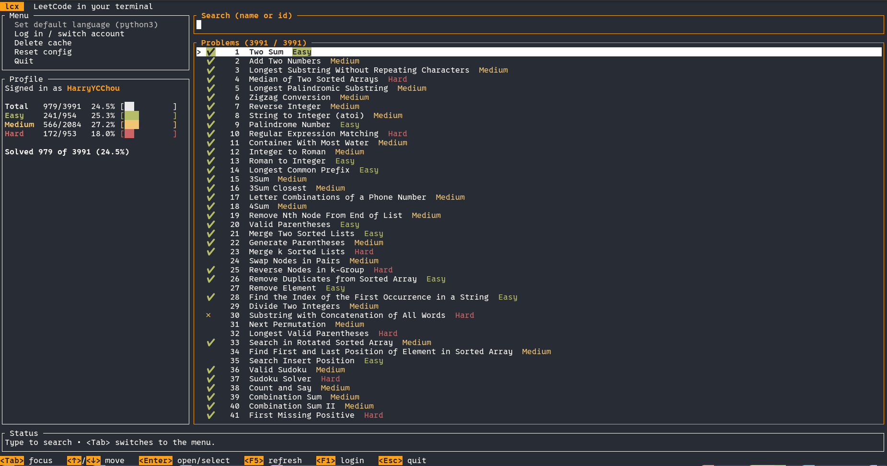
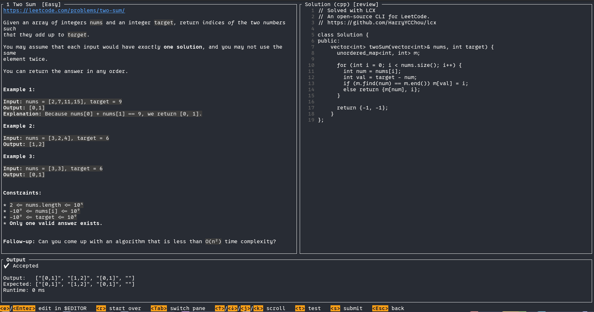

# lcx — LeetCode in your terminal

[](https://github.com/HarryYCChou/lcx/actions)
[](https://github.com/HarryYCChou/lcx/releases)
[](LICENSE)

`lcx` lets you browse, read, solve, test, and submit LeetCode problems without
leaving your terminal. It talks to the live LeetCode API (GraphQL + judge
endpoints) and caches the problem list locally for instant browsing.

Run it with no arguments for a full **interactive TUI**, or use the individual
subcommands for scripting and one-offs. The core (HTTP client, cache, config) is
deliberately separated from the presentation layer, so the CLI and TUI share the
same LeetCode logic.

## Support

If `lcx` saves you time, consider supporting its development:

<p align="center">
<a href="https://github.com/sponsors/HarryYCChou"></a>
<a href="https://ko-fi.com/HarryYCChou"></a>
<a href="https://www.buymeacoffee.com/HarryYCChou"></a>
</p>

## Demo

<!-- Record a short session and drop the file at docs/demo.gif.
     Tip: `asciinema rec` then `agg demo.cast docs/demo.gif`, or use `vhs`. -->


## Installation

Prebuilt binaries are attached to the [latest release](https://github.com/HarryYCChou/lcx/releases/latest).

### Linux

```bash
# x86_64
curl -LO https://github.com/HarryYCChou/lcx/releases/latest/download/lcx-x86_64-unknown-linux-gnu.tar.gz
tar -xzf lcx-x86_64-unknown-linux-gnu.tar.gz
install -m 755 lcx ~/.local/bin/lcx   # or somewhere on your PATH
```

### macOS

```bash
# Apple Silicon
curl -LO https://github.com/HarryYCChou/lcx/releases/latest/download/lcx-aarch64-apple-darwin.tar.gz
tar -xzf lcx-aarch64-apple-darwin.tar.gz

# universal (works with or without Homebrew)
sudo mkdir -p /usr/local/bin
sudo install -m 755 lcx /usr/local/bin/lcx

# or, if you use Homebrew (already on PATH, no sudo needed):
install -m 755 lcx /opt/homebrew/bin/lcx
```

The binary is unsigned, so macOS may quarantine it. If it refuses to run:
`xattr -d com.apple.quarantine "$(command -v lcx)"`.

### Windows

Download and extract the zip, then put `lcx.exe` somewhere on your `PATH`
(PowerShell):

```powershell
Invoke-WebRequest -Uri https://github.com/HarryYCChou/lcx/releases/latest/download/lcx-x86_64-pc-windows-msvc.zip -OutFile lcx.zip
Expand-Archive lcx.zip -DestinationPath .
```

### From source

Requires a recent Rust toolchain ([rustup](https://rustup.rs/)).

```bash
git clone https://github.com/HarryYCChou/lcx.git
cd lcx
cargo build --release
# binary at ./target/release/lcx
```

Copy `target/release/lcx` somewhere on your `PATH` (e.g. `~/.local/bin`).

## Quick Start

`lcx` is TUI-first — the whole flow (log in, search, solve) happens in the app:

```bash
# 1. Populate the local problem cache
lcx cache --update

# 2. Launch the interactive TUI
lcx

# From here everything happens inside the TUI:
# 3. Log in           <F1> opens the login modal; it auto-detects your browser
#                     cookies (<F3> opens the LeetCode login page), then <Enter>
#                     manual login? see "Finding your session cookies" below
# 4. Set language     first time only: <Tab> to the menu, pick "Set default
#                     language", <Enter> to choose (used for new solution files)
# 5. Pick a problem   <Tab> back to search, type to filter, <↑>/<↓> move, <Enter> open
# 6. Write code       <e> (or <Enter>) opens the file in $EDITOR; <r> starts over
# 7. Test & submit    <t> runs the sample cases, <s> submits for a verdict
#                     <Esc> goes back to the list (<Esc> again quits)
```

> **Windows:** to use cookie auto-detect with Chrome/Edge/Brave, launch `lcx`
> from a PowerShell running **as administrator** (their cookies are app-bound
> encrypted). Right-click PowerShell -> "Run as administrator", or run
> `Start-Process powershell -Verb RunAs`, then run `lcx`. Firefox and manual
> login work without admin.

## Commands

| Command | Description |
| --- | --- |
| `lcx` | Launch the interactive TUI (default) |
| `lcx login [--session <s>] [--csrf <c>]` | Save session credentials (prompts if omitted) |
| `lcx whoami` | Show the currently authenticated user |
| `lcx list [--difficulty] [--tag] [--status] [--query] [--limit]` | List cached problems with filters |
| `lcx show <id\|slug> [--lang] [--code]` | Show a problem's description (optionally starter code) |
| `lcx pick <id\|slug> [--lang] [--no-open]` | Generate a solution file and open it |
| `lcx edit <id\|slug> [--lang] [--no-open]` | Reopen (or generate) a solution file |
| `lcx test <id\|slug\|path> [--case] [--lang]` | Run a solution against sample/custom cases |
| `lcx submit <id\|slug\|path> [--lang]` | Submit a solution and print the verdict |
| `lcx daily [--pick]` | Show today's daily challenge (optionally scaffold it) |
| `lcx cache [--update] [--clear]` | Manage the local problem cache |
| `lcx config [set <key> <value>]` | View or change configuration (`lang`, `editor`, `workspace`) |

### Authentication

LeetCode has no official API, so `lcx` uses the same session cookies your browser
does.

- **Easiest:** launch `lcx` and let the login modal **auto-detect** cookies from a
  browser you're already signed into (press `F3` to open the login page first).
  On **Windows**, Chrome/Edge/Brave encrypt cookies with app-bound encryption, so
  auto-detect can only read them if you run `lcx` as administrator; otherwise use
  Firefox or the manual method below.
- **Manual:** copy your `LEETCODE_SESSION` and `csrftoken` cookies (see
  [Finding your session cookies](#finding-your-session-cookies)), then:

```bash
lcx login --session "<LEETCODE_SESSION>" --csrf "<csrftoken>"
# or just `lcx login` to be prompted
```

Credentials are stored at `~/.config/lcx/config.toml` with `600` permissions.
Verify with `lcx whoami`.

### Finding your session cookies

You only need this for manual login (the TUI can auto-detect cookies for you).

1. Open [leetcode.com](https://leetcode.com) in your browser and **sign in**.
2. Open your browser's developer tools:
   - **Chrome / Edge / Brave:** `F12` (or `Ctrl+Shift+I`, `Cmd+Option+I` on macOS)
     → **Application** tab → **Storage** → **Cookies** → `https://leetcode.com`.
   - **Firefox:** `F12` → **Storage** tab → **Cookies** → `https://leetcode.com`.
3. Find these two rows and copy each **Value**:
   - `LEETCODE_SESSION` — a long token (this is your session).
   - `csrftoken` — a shorter token.
4. Pass them to `lcx login` as shown above.

Treat these like a password: they grant access to your LeetCode account. They
expire periodically, so if requests start failing, grab fresh values or run
`lcx login` again.

### Advanced: work from the command line

Prefer to skip the TUI? The whole solve loop is available as plain commands:

```bash
lcx login                    # sign in (see Authentication / Finding your session cookies)
lcx list --difficulty easy   # browse problems
lcx pick 1 --lang rust       # scaffold a solution file and open your editor
lcx test 1                   # run against sample cases
lcx submit 1                 # submit for a verdict
```

More examples:

```bash
lcx list --tag array --status todo --query "two sum" --limit 20
lcx show two-sum --code
lcx test ~/lcx/1.two-sum.rs
lcx test 1 --case $'[2,7,11,15]\n9'
lcx daily --pick
lcx config set editor "code -w"
```

Solution files are written to the workspace directory as `{id}.{slug}.{ext}` with
a metadata header comment so `test`/`submit` can identify the problem
automatically. Config lives at `~/.config/lcx/config.toml`, the cache at
`~/.config/lcx/cache.sqlite`, and solutions default to `~/lcx/`.

### Supported languages

`rust`, `python3`, `cpp`, `c`, `java`, `csharp`, `javascript`, `typescript`,
`go`/`golang`, `ruby`, `swift`, `kotlin`, `scala`, `php`, `dart`, `elixir`,
`erlang`, `racket`, `mysql`, and more. Set a default with
`lcx config set lang <slug>` or override per command with `--lang`.

## Screenshots

<!-- Drop PNGs under docs/screenshots/ and update the captions below. -->

**Login modal** — auto-detects browser cookies:



**Main dashboard** — menu, profile stats, and problem search:



**Solve view** — description, solution preview, and test/submit output:



### TUI at a glance

- **Login modal** — hands-free cookie auto-detection (`F3` open login page, `F2`
  toggle auto-detect, `F4` browse offline, `Esc` cancel). Function keys are used
  because multiplexers like tmux reserve the Ctrl prefix.
- **Main dashboard** — `Tab` switches focus between the action menu (set language,
  login, delete cache, reset config, quit) and the problem search; `F5` refresh,
  `F1` login, `Esc` quit.
- **Solve view** — left: description with LeetCode's inline markup preserved;
  right: read-only solution preview. `e`/`Enter` edit in `$EDITOR`, `r` start over,
  `Tab` cycle panes, `j`/`k` scroll, `t` test, `s` submit, `Esc` back.

## Roadmap

- leetcode.cn endpoint support
- Tag/difficulty/status filters inside the TUI browser
- Syntax highlighting in the solve-view code preview
- Submission history browsing

## Contributing

Contributions are welcome! Before opening a pull request, make sure the following
pass:

```bash
cargo fmt --all
cargo clippy --all-targets -- -D warnings
cargo test
```

Guidelines:

- Branch off `main` (`feat/…`, `fix/…`, `chore/…`).
- Use [Conventional Commits](https://www.conventionalcommits.org/) (`feat:`,
  `fix:`, `chore:`, …); the type drives the version bump.
- Follow [Semantic Versioning](https://semver.org/); the version lives in
  `Cargo.toml`, and notable changes go in [`CHANGELOG.md`](CHANGELOG.md).
- Keep the client layer (`src/client`) free of presentation logic and reuse the
  shared helpers.
- Never commit credentials (`config.toml`, session/csrf cookies).

> LeetCode's endpoints are unofficial and may change; if requests start failing,
> refresh your cookies with `lcx login`.

## License

MIT
